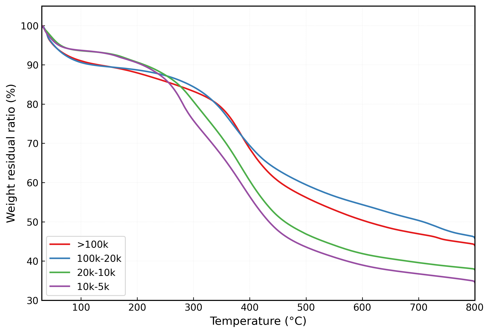
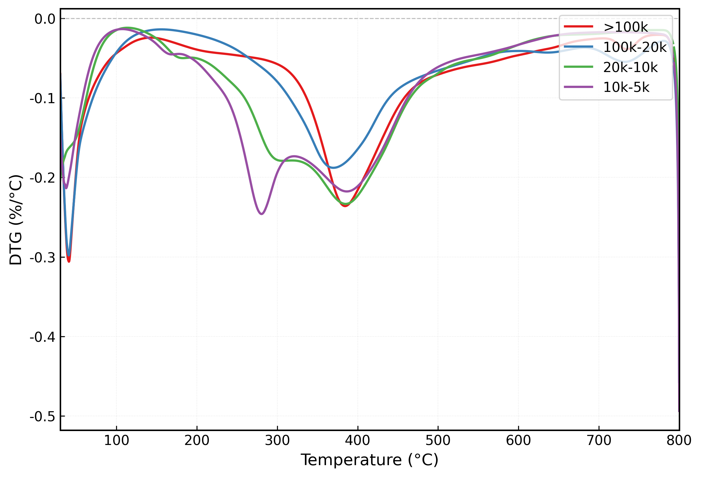
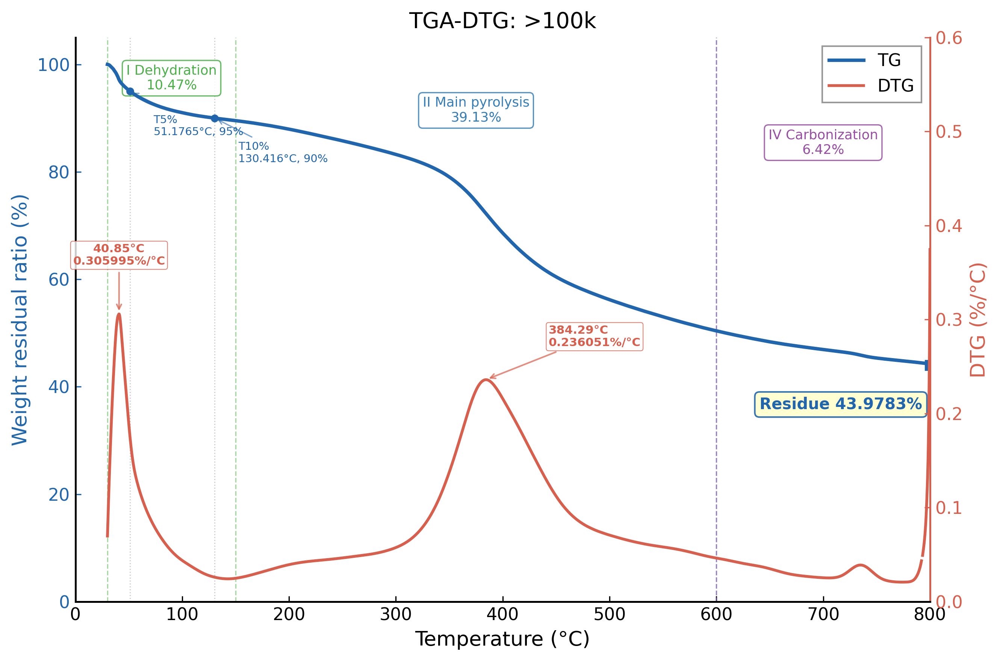
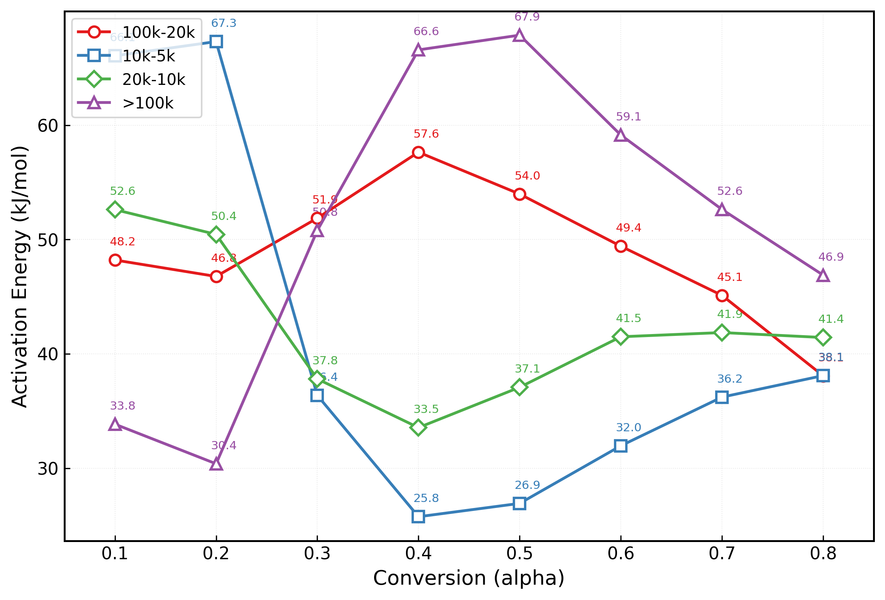
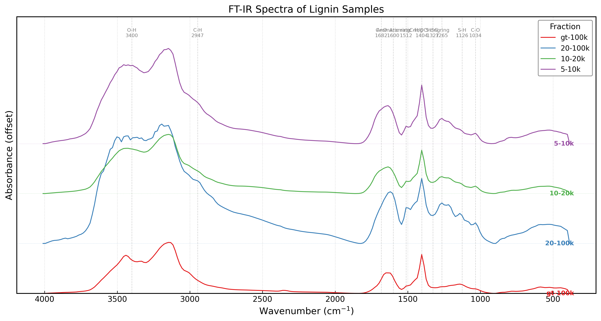

# ChemEng-Toolkit

**Python toolkit for chemical engineering data analysis** — TGA/DSC processing, FT-IR spectroscopy, pyrolysis kinetics, and distillation column design.

Built by a chemical engineering student for undergraduate research and coursework projects.

## Features

- **TGA/DSC Processing** — Load raw .xls files from TA Instruments, plot TG/DTG curves, identify decomposition stages, extract characteristic parameters (T5%, T10%, Tmax, residue)
- **Pyrolysis Kinetics** — Coats-Redfern method with 15 reaction mechanism models (F1-F3, R2-R3, D1-D4, A2-A4, P2-P4), segmented alpha-dependent activation energy analysis
- **FT-IR Spectroscopy** — Load CSV spectral data, stacked offset plots with absorption peak annotations
- **Publication-quality plots** — Matplotlib-based with consistent color schemes and professional styling

## Example Gallery

| TG Curves | DTG Curves |
|:---:|:---:|
|  |  |

| Dual-Axis TGA-DTG | Ea vs. Alpha |
|:---:|:---:|
|  |  |

| FT-IR Stacked Spectra |
|:---:|
|  |

## Quick Start

```bash
# Install
pip install -e .

# Or with conda
conda install -c conda-forge numpy pandas matplotlib scipy xlrd openpyxl
pip install -e .
```

### TGA Analysis

```python
from chemeng_toolkit.thermal_analysis import TGAProcessor

# Load data
processor = TGAProcessor()
data = processor.load_from_xls("data/tga_sample/gt_100k.xls")

# Plot
processor.plot_tg()
processor.plot_dtg()
processor.plot_dual_axis(">100k")

# Extract parameters
summary = processor.summary_table()
```

### FT-IR Analysis

```python
from chemeng_toolkit.thermal_analysis import FTIRProcessor

processor = FTIRProcessor(data_dir="data/ftir_sample")
processor.load_batch([
    ("sample.CSV", "Label", "#1f77b4"),
])

processor.plot_stacked(title="FT-IR Spectra")
```

### Kinetic Analysis

```python
from chemeng_toolkit.thermal_analysis import coats_redfern, plot_ea_vs_alpha

results = coats_redfern(temp, weight)
print(f"Best model: {results[0]['code']}, E = {results[0]['E_kJ']:.2f} kJ/mol")
```

## Project Structure

```
ChemEng-Toolkit/
├── chemeng_toolkit/
│   ├── thermal_analysis/
│   │   ├── tga_processor.py      # TGA data loading and visualization
│   │   ├── kinetics.py           # Coats-Redfern kinetic analysis
│   │   └── ftir_processor.py     # FT-IR spectral processing
│   └── utils/
│       └── plot_helpers.py       # Shared styling and utilities
├── examples/
│   ├── tga_example.ipynb         # TGA analysis walkthrough
│   └── ftir_example.ipynb        # FT-IR analysis walkthrough
└── data/
    ├── tga_sample/               # Sample TGA .xls files
    └── ftir_sample/              # Sample FT-IR .CSV files
```

## Background

This toolkit was developed during undergraduate research on **lignin characterization and biomass valorization** at Guangdong University of Technology (B.Eng. Chemical Engineering, expected June 2026). It covers material from: Thermodynamics, Transport Phenomena, Reaction Engineering, and Separation Processes.

## Requirements

- Python >= 3.9
- numpy, pandas, matplotlib, scipy
- xlrd (for .xls TGA data)
- openpyxl (for .xlsx support)

## License

MIT
